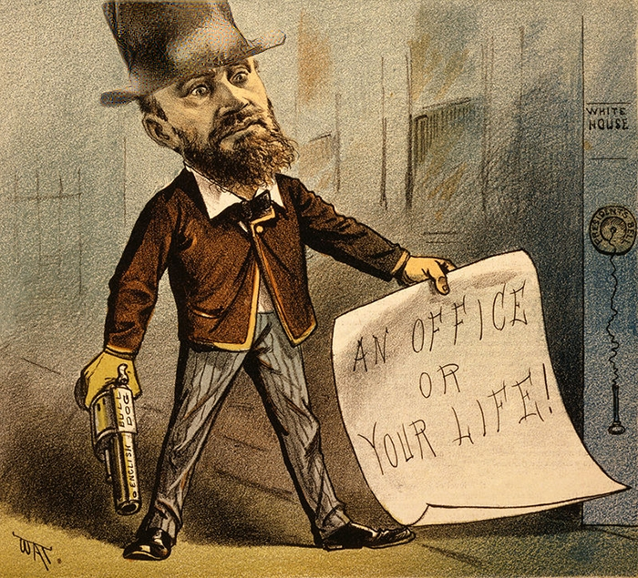

# deep-painterly-harmonization
Code and data for paper "[Deep Painterly Harmonization](Arxiv: TBD)"

## Disclaimer 
**This software is published for academic and non-commercial use only.**

## Setup
This code is based on torch. It has been tested on Ubuntu 16.04 LTS.

Dependencies:
* [Torch](https://github.com/torch/torch7) (with [matio-ffi](https://github.com/soumith/matio-ffi.torch) and [loadcaffe](https://github.com/szagoruyko/loadcaffe))
* [Matlab](https://www.mathworks.com/) or [Octave](https://www.gnu.org/software/octave/)

CUDA backend:
* [CUDA](https://developer.nvidia.com/cuda-downloads)
* [cudnn](https://developer.nvidia.com/cudnn)

Download VGG-19:
```
sh models/download_models.sh
```

Compile ``cuda_utils.cu`` (Adjust ``PREFIX`` and ``NVCC_PREFIX`` in ``makefile`` for your machine):
```
make clean && make
```

## Usage
### Quick start
To generate all results (in ''data/'') using the provided scripts, simply run
'''
python gen_all.py
'''
in Python and then 
'''
run('filt_cnn_artifact.m')
'''
in Matlab or Octave. The final output will be in ''results/''.

## Examples
Here are some results from our algorithm (from left to right are painting, naive composite and our output):
<p align='center'>
  
  
  
</p>


